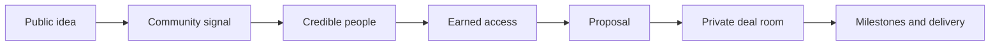

# PassionHouse

> The public idea network where credible people find each other and turn conviction into execution.

PassionHouse is a polished, local-first MVP for publishing serious ideas, discovering the people who can move them forward, controlling sensitive disclosure, agreeing on a collaboration, and doing the work in one place.

It combines the openness of a social feed with the trust and structure missing from most social platforms. Ideas begin in public. Identity and proof make the people around them legible. Sensitive material stays creator-controlled. When the fit is real, the conversation becomes a proposal and then a private deal room.

**The platform takes 0% equity.**

## Why PassionHouse exists

Good ideas rarely fail because nobody can write a pitch deck. They fail in the space between posting and execution:

- The right builder never sees the idea.
- A founder cannot tell a credible collaborator from a loud stranger.
- Creators either reveal too much publicly or share too little to earn interest.
- Useful conversations disappear across replies, DMs, documents, and calls.
- A promising connection has no natural path into scope, terms, milestones, and delivery.

Existing networks optimize for attention. Talent marketplaces optimize for transactions. Project tools begin after a team already exists. PassionHouse connects those stages into one trust-aware system.

## The product thesis

An idea should be able to move through a continuous path:



The public layer creates discovery. The identity layer creates confidence. The disclosure layer protects creators. The execution layer prevents momentum from leaking into a dozen disconnected tools.

## What makes it different

### Ideas are posts, not listings

Discover is designed as a living feed rather than a marketplace grid. A creator can publish a full thesis, not just a title and a category. Each post can contain:

- Up to 10,000 characters of long-form thinking
- A clear one-line thesis
- Stage, sector, evidence, and current ask
- Images and video
- Validation metrics
- Comments, useful votes, and builder interest
- A public signal score

Every idea is public by design. This keeps the network discoverable and prevents a feed full of empty, locked cards.

### Privacy lives at the material level

Creators do not have to choose between exposing everything and hiding the entire opportunity. Every uploaded image or video can be marked separately as:

- **Public** — visible directly in the Discover feed
- **Private** — visible only to the creator and people whose access request has been approved

The public thesis attracts the right people. Sensitive diagrams, financial material, partner information, and execution details can remain protected.

### Disclosure is earned in layers

An interested builder can request one of three levels:

1. **Context** — problem framing and non-sensitive research
2. **Build brief** — workflow, requirements, and deeper validation
3. **Full room** — commercial detail, private materials, and execution plan

The creator reviews the requester’s profile, social proof, platform behavior, and reason for asking. They can approve the requested tier, grant a smaller tier, or decline.

### Credibility is more than followers

PassionHouse treats identity as a blend of external proof and behavior. The demo score combines:

- Connected social identity
- Audience size and recent growth
- Execution history
- Community trust
- Responsiveness
- Completed projects and collaborations
- References and other verified signals

Users can connect X, LinkedIn, GitHub, Instagram, and a personal website. Connecting another account updates the credibility model in the demo. Follower count contributes context, but it never determines trust by itself.

### People are searchable and reachable

The People graph can be searched by:

- Name or `@handle`
- Role or location
- Skill
- What the person is open to
- Connected social handle

Public profiles show credibility, its breakdown, work history, public ideas, connected accounts, follower and growth signals, availability, and direct contact routes.

### Collaboration becomes execution

After access is approved, a builder can submit a structured proposal with:

- Outcome
- Summary
- Scope
- Timeline
- Budget

Accepting the proposal opens a private deal room containing:

- Participant chat
- Agreed terms
- Milestones and progress
- Documents
- Ownership language
- A clear reminder that PassionHouse takes no equity

## MVP experience

### 1. Enter with X

The onboarding screen simulates an X OAuth flow. The user can continue with the featured identity or select another demo X persona.

This is intentionally a safe demo: no request is sent to X, no real token is created, and no external account is modified.

### 2. Discover ideas

The feed supports:

- “For you” and “Latest” views
- Search across ideas, long-form content, creators, and handles
- Sector and stage filters
- Sorting by signal, recency, or interest
- Public and locked media previews
- Likes, dislikes, comments, and interest

### 3. Explore people

Search the builder graph, inspect trust signals, open public profiles, and follow connected social links to make contact.

### 4. Publish

The two-step composer collects the public thesis first and collaboration evidence second. Images and videos can be uploaded from the device and individually marked public or private.

### 5. Control access

Creators receive structured access requests and can decide exactly how much to reveal.

### 6. Propose and build

Approved collaborators submit terms. Accepted proposals create deal rooms where the relationship becomes measurable work.

## Investor-demo scenarios

The seeded data supports a complete walkthrough:

1. Continue with X as Maya Chen.
2. Browse the public idea feed.
3. Open Loopline to inspect its long thesis and public/private media model.
4. Open another creator’s public profile and inspect connected accounts.
5. Visit Maya’s profile and connect GitHub to see credibility change.
6. Review incoming access requests for Loopline.
7. Grant a smaller or equal disclosure tier.
8. Review structured proposals.
9. Accept a proposal to create a deal room.
10. Send a message, complete a milestone, and attach a document.
11. Publish a new public idea with an image or video.

## Design language

The interface adapts the design language developed for HoodX:

- Pure black foundation
- Monochrome white/graphite hierarchy
- Arial/Helvetica display typography
- Monospaced system metadata
- Star-field texture, orbital lines, binary fragments, and quiet meteor motion
- Minimal borders and glass-like black surfaces
- High-contrast actions with almost no decorative color

The result is intentionally closer to a private signal terminal than a conventional startup marketplace.

## Technology

- Next.js 15 App Router
- React 19
- TypeScript in strict mode
- Tailwind CSS 4
- Radix/shadcn UI primitives
- Lucide icons
- Sonner notifications
- Browser local storage repository

## Architecture

```text
app/
  layout.tsx                       Metadata and root shell
  page.tsx                         PassionHouse entry page
  globals.css                      HoodX-inspired design system
components/
  passionhouse-app.tsx             Product flows and interactive UI
  ui/                              Reusable interface primitives
lib/
  passionhouse-types.ts            Domain model
  passionhouse-demo.ts             Seeded people, ideas and deal data
  passionhouse-repository.ts       Replaceable local repository adapter
  utils.ts                         Shared utilities
public/
  media/                            Project-owned demo media
```

The application is deliberately separated into a typed domain state and a repository adapter. UI actions do not call `localStorage` directly. Replacing the demo layer with Supabase, Postgres, or another backend can happen behind the repository/API boundary without redesigning the product model.

## Local data model

The MVP persists these entities:

- User profiles and connected socials
- Public ideas and media visibility
- Comments and reactions
- Interest signals
- Access requests and granted tiers
- Proposals
- Deal rooms, messages, milestones, and documents
- Local demo accounts

The schema is versioned. Incompatible old demo state is safely replaced with fresh seed data.

## Run locally

### Requirements

- Node.js 20 or newer
- npm

### Install

```bash
npm ci
```

### Start development

```bash
npm run dev
```

Open [http://localhost:3000](http://localhost:3000).

### Validate

```bash
npx tsc --noEmit
npx eslint components/passionhouse-app.tsx lib app
npm run build
```

### Production

```bash
npm run build
npm start
```

## Deploy to Vercel

1. Push this repository to GitHub.
2. Import the repository in Vercel.
3. Keep the detected framework as Next.js.
4. Deploy; the MVP does not require environment variables.

## Demo boundaries

This repository is an investor-demo-ready MVP, not a production authentication or file-storage system.

- X OAuth is simulated.
- Social metrics are seeded demo data.
- Uploaded media is encoded locally for the active browser; the composer limits upload batches to keep the demo reliable.
- Password-based local demo accounts use client-side hashing and are not production authentication.
- Deal-room documents store metadata only.
- There is no server authorization layer yet.
- External social links are illustrative demo destinations.

Do not store secrets or sensitive real-world deal material in the local MVP.

## Production roadmap

### Phase 1 — real identity and durable data

- X OAuth 2.0 / OpenID Connect
- Supabase or Postgres
- Object storage with signed URLs
- Server-side authorization for disclosure tiers
- Profile editing and social account verification
- Full-text and semantic search

### Phase 2 — trust and matching

- Transparent credibility calculation
- Anti-gaming and account-quality checks
- Reference requests and verified project outcomes
- Skill and opportunity matching
- Personalized feed ranking
- Notifications and saved searches

### Phase 3 — execution infrastructure

- Real-time deal-room chat
- Versioned agreements
- E-signatures
- Milestone approvals
- Payments or escrow integrations
- Project outcome proofs that feed back into credibility

## Why it could be revolutionary

PassionHouse can become a missing coordination layer for the internet’s builders.

Social platforms are excellent at revealing interest but weak at establishing fit. Professional networks expose résumés but rarely show present intent. Freelance marketplaces commoditize people into bids. Project software assumes the team is already formed.

PassionHouse begins one step earlier—with the idea—and carries the relationship through trust, disclosure, agreement, and execution. If that loop works, every completed collaboration makes the network more useful: ideas gain evidence, people gain portable proof, and future teams can form with less uncertainty.

The long-term opportunity is not another place to post startup ideas. It is an operating system for turning credible public intent into real shared work.

## License

Private project. All rights reserved.
